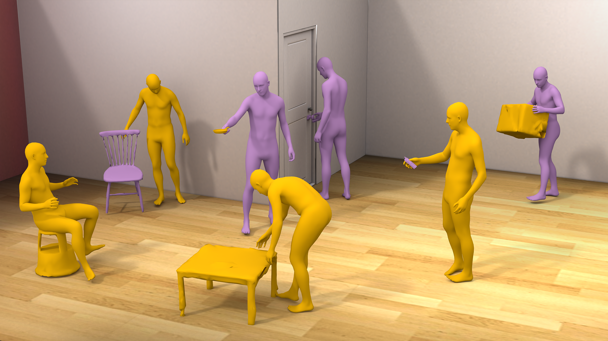

# MSF-HOI: Multi-Stream Rectified Flow for Plausible Trilateral 3D Human-Object Interaction



All commands below are run from the project root.

## 1. Environment

```bash
conda env create -f environment.yml
conda activate msf-hoi
```

## 2. Data Preparation

### 2.1 Processing Protocol

Data preparation for GRAB and BEHAVE follows the [TriDi GitHub repository](https://github.com/ptrvilya/tridi) and its [data preparation instructions](https://github.com/ptrvilya/tridi/blob/main/docs/data.md).

### 2.2 GRAB

Register at the [official GRAB website](https://grab.is.tue.mpg.de/), accept the license, and download the data. After completing the TriDi preprocessing procedure, place the files at:

```text
data/grab_smplh_ground/dataset_train_10fps.hdf5
data/grab_smplh_ground/dataset_test_1fps.hdf5
data/grab_smplh_ground/object_pointnext.pkl
data/grab_smplh_ground/object_keypoints_meshsample1500/{object}.npz
```

### 2.3 BEHAVE

Complete the registration, license, and download procedure on the [official BEHAVE website](https://virtualhumans.mpi-inf.mpg.de/behave/license.html). After completing the TriDi preprocessing procedure, place the files at:

```text
data/behave_smplh_ground/dataset_train_10fps.hdf5
data/behave_smplh_ground/dataset_test_1fps.hdf5
data/behave_smplh_ground/object_pointnext.pkl
data/behave_smplh_ground/object_keypoints_meshsample1500/{object}.npz
```

### 2.4 SMPL+H, Segmentation, and Model Assets

Download `msf_hoi.pt`from the [link](https://drive.google.com/drive/folders/1ocD8kjMj9dCGWjSSsGG1wTG3dS_JcdH4?usp=sharing) and place it at `assets/msf_hoi.pt`; download [`gb_contacts.pth`](https://nc.mlcloud.uni-tuebingen.de/public.php/dav/files/bmsRACRqzCQ4QPq/gb_contacts.pth) according to the [TriDi pretrained-model instructions](https://github.com/ptrvilya/tridi#pretrained-model) and place it at `assets/gb_contacts.pth`; download the SMPL/SMPL+H models and the corresponding segmentation and template-index resources from the [official SMPL website](https://smpl.is.tue.mpg.de/), place the model files in `data/smplx_models/`, and place the following files at the indicated paths:

```text
data/smpl_segmentation.pkl
data/smpl_template_decimated_idxs.npy
```

### 2.5 Object SDF

After preparing the object meshes and HDF5 files in the two dataset directories, run the SDF preprocessing script from the project root:

```bash
python generate_object_sdf_grids.py --data-root data --datasets behave grab
```

## 3. Sampling

Run the following command to generate samples:

```bash
python sample_msf_hoi.py --mode 111 --repetitions 3 --output-root experiments
```

The three digits in `mode` correspond to the human, object, and contact modalities, respectively. `0` denotes a conditioning modality and `1` denotes a generated modality; therefore, `111` generates all three modalities.

## 4. Evaluation

The evaluation script reads the generated samples and computes the selected evaluation metrics. The results are saved as a JSON file; an example command is:

```bash
python evaluate_msf_hoi_samples.py --sample-root experiments/001_111 --data-root data --output-json experiments/001_111/evaluation_metrics.json
```
